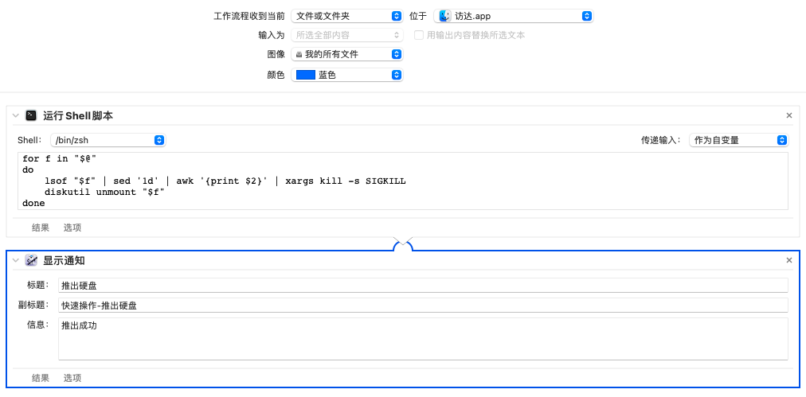

你可以直接下载workflow文件导入

---
也可以自己在mac上新建自动操作

自动操作 -> 快速操作 -> 然后按照以下图片自行添加



---
shell脚本
```
for f in "$@"
do
	lsof "$f" | sed '1d' | awk '{print $2}' | xargs kill -s SIGKILL
	diskutil unmount "$f"
done
```

---
当然，如果你不想用Mac的自动操作，可以直接在控制台依次执行以下两条命令完成 推出硬盘 的操作
```
lsof 外接硬盘路径 | sed '1d' | awk '{print $2}' | xargs kill -s SIGKILL
```
```
diskutil unmount 外接硬盘路径
```
example:
```
lsof /Volumes/新加卷 | sed '1d' | awk '{print $2}' | xargs kill -s SIGKILL
diskutil unmount /Volumes/新加卷
```